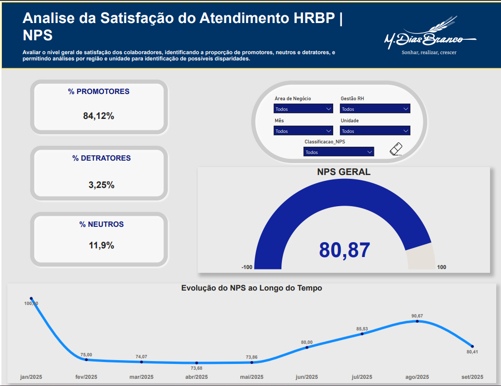
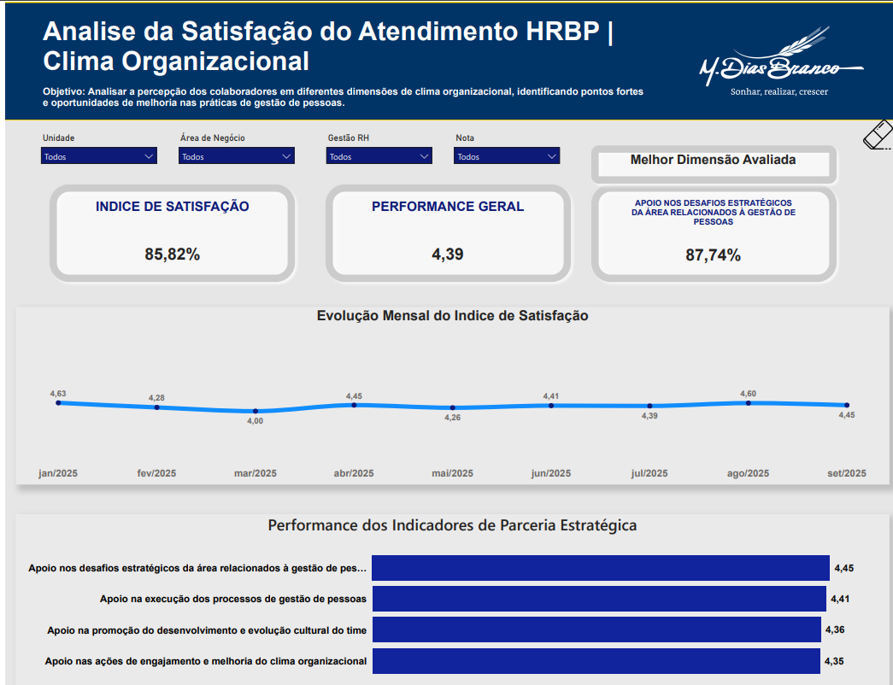
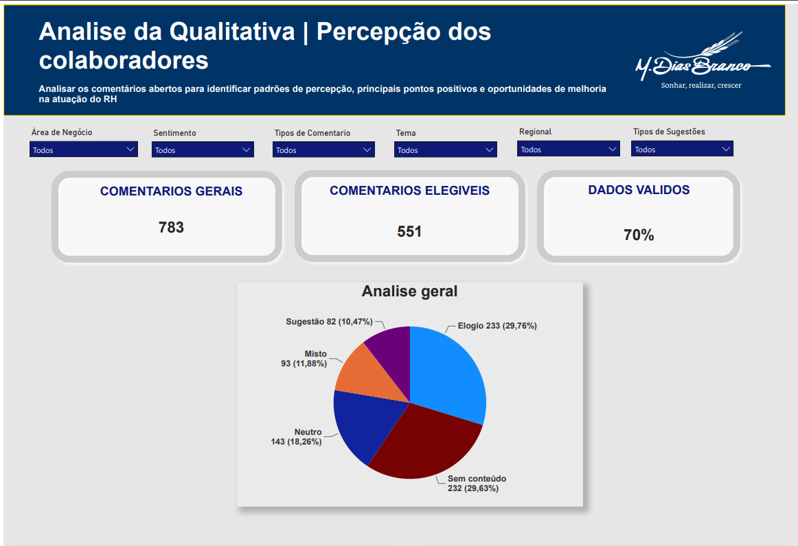

# Dashboard de People Analytics (NPS, Analise de Clima e Insight de Feedbacks)

Projeto: Dashboard de Gestão de Performance e Clima (People Analytics)

Contexto: Case técnico desenvolvido como desafio de seleção para a empresa M. Dias Branco. O objetivo foi criar uma solução de BI para monitorar a satisfação dos colaboradores, NPS (Net Promoter Score) e análise qualitativa de feedbacks.

Tecnologias & Habilidades Aplicadas:
Ferramenta: Power BI (Desktop).

Modelagem: Tratamento de base de dados para análise de NPS e categorias de sentimentos.

DAX: Criação de medidas para cálculo de NPS, evolução temporal e filtros dinâmicos por regional/negócio.

Visualização: Criação de dashboards interativos com foco em storytelling de dados.

O que o Dashboard resolve (Insights):
Visão Geral de Clima: Monitoramento do Índice de Satisfação (85,82%) e performance geral (4,39).

Evolução Estratégica: Identificação de que o "Apoio nos desafios estratégicos" é a dimensão mais bem avaliada (87,74%).

Análise Qualitativa: Processamento de 783 comentários, onde quase 30% foram classificados como elogios, permitindo identificar padrões de percepção sobre a atuação do RH.

Diagnóstico Geográfico/Negócio: Capacidade de comparar o NPS e o índice de satisfação entre Regionais e Unidades, permitindo planos de ação direcionados.

## 📸 Visão Geral do Dashboard

### 1. Indicadores de NPS e Evolução

### 2. Dimensões de Clima Organizacional

### 3. Análise Qualitativa (Comentários)

---
### 💡 Principais Aprendizados
Durante este desafio, desenvolvi a habilidade de transformar dados brutos e comentários não estruturados em uma narrativa clara de negócio (Storytelling). Compreendi que um dashboard de People Analytics eficaz não serve apenas para exibir métricas de satisfação, mas para identificar "gargalos" operacionais — como a diferença de percepção entre regionais — e orientar decisões de RH baseadas em evidências. Este projeto reforçou minha capacidade de modelar indicadores complexos em DAX e de traduzir indicadores qualitativos em planos de ação concretos.
